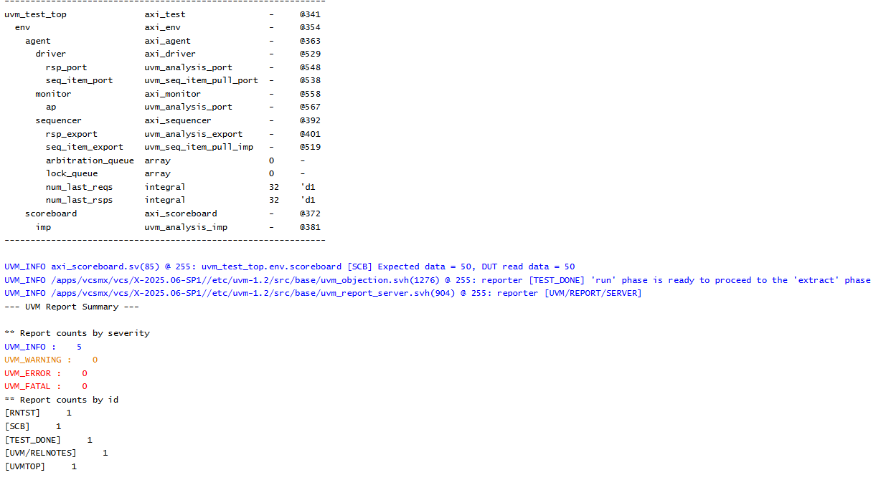

# AXI4 UVM Verification Project

This project is developing a SystemVerilog/UVM verification environment for an AXI4 memory-mapped slave. The work is being built incrementally: first understanding the AXI4 protocol, then creating the UVM components, and finally extending the environment toward broader protocol coverage and reusable verification.

## Project goal

The long-term goal is to verify an AXI4 slave through a structured UVM testbench rather than relying only on directed signal-level tests. The environment is intended to:

- Generate AXI4 read and write transactions.
- Drive those transactions through the AXI interface.
- Observe and reconstruct transactions from bus activity.
- Maintain a reference model in the scoreboard.
- Compare DUT behavior against expected results automatically.
- Gradually verify bursts, byte enables, alignment, responses, IDs, outstanding transactions, ordering, assertions, and functional coverage.

The project also serves as a practical study of the AXI4 protocol and UVM architecture, including the relationship between sequences, sequencers, drivers, monitors, scoreboards, phases, objections, interfaces, and transaction-level communication.

## Verification architecture

The intended transaction flow is:

```text
Sequence → Sequencer → Driver → AXI Interface → DUT → Monitor → Scoreboard
```

The current UVM structure contains:

- **Sequence** — Creates constrained-random and directed AXI transactions.
- **Sequencer** — Sends transactions from the sequence to the driver.
- **Driver** — Converts transaction objects into AXI signal activity.
- **Monitor** — Observes the AXI channels and reconstructs completed transactions.
- **Scoreboard** — Maintains reference memory and compares expected and actual read data.
- **Agent** — Contains the sequencer, driver, and monitor.
- **Environment** — Builds the agent and scoreboard and connects the monitor analysis port.
- **Test** — Creates the environment, starts the sequence, and controls the UVM objection.
- **Top-level testbench** — Generates the clock and reset, configures the virtual interface, instantiates the DUT, and starts UVM.

## Current working milestone

The first complete basic AXI4 UVM flow is working. The current milestone uses a controlled test so that the basic environment can be validated before adding more complicated protocol behavior.

The current end-to-end path supports:

- One basic AXI write transaction.
- One basic AXI read transaction to the same address.
- Basic memory storage in the simple slave DUT.
- Driver handshaking on the basic AXI write and read channels.
- Monitor reconstruction of the write and read activity.
- Reference-memory updates in the scoreboard.
- Automatic comparison of expected data with DUT read data.
- Complete communication through the UVM hierarchy.

The sequence includes a fully constrained-random transaction as well as directed transactions. The working milestone shown in the simulation result is the directed write/read case: the test writes data value `50` to address `100`, then reads the same address.

## Working simulation result

The screenshot below is the current basic AXI4 result from EDA Playground.

The UVM topology is printed, showing the test, environment, agent, driver, monitor, sequencer, and scoreboard. The scoreboard reports:

```text
Expected data = 50
DUT read data = 50
```

The UVM report summary shows zero warnings, zero errors, and zero fatal messages. This confirms that the basic write-to-memory and read-back path is working through the complete UVM environment.



## Project files

- `tb_top.sv` — Top-level testbench, clock, reset, virtual-interface configuration, DUT instance, and UVM startup.
- `axi_if.sv` — AXI interface and channel signals.
- `axi_txn.sv` — AXI transaction object containing operation, ID, address, burst, data, strobes, and response fields.
- `axi_sequence.sv` — Constrained-random and directed stimulus.
- `axi_sequencer.sv` — UVM sequencer.
- `axi_driver.sv` — Drives transaction information onto the AXI interface.
- `axi_monitor.sv` — Observes bus activity and publishes completed transactions.
- `axi_scoreboard.sv` — Reference-memory model and data comparison logic.
- `axi_agent.sv` — Groups the sequencer, driver, and monitor.
- `axi_env.sv` — Builds and connects the agent and scoreboard.
- `axi_test.sv` — Creates the environment and starts the sequence.
- `docs/axi4_uvm_basic_test_result.png` — Screenshot of the current working simulation result.

## Current limitations

The current implementation is intentionally a basic starting point. The following features have been studied or planned but are not yet fully implemented in the code:

- Complete burst support for FIXED, INCR, and WRAP bursts.
- Multiple outstanding transactions.
- Out-of-order response handling.
- Full transaction-ID ordering checks.
- Narrow and unaligned transfers.
- Complete `WSTRB` behavior.
- 4 KB boundary checking.
- AXI error responses and broader response testing.
- Protocol assertions.
- Functional coverage.
- Larger constrained-random regressions.

The current DUT is also a simple memory slave used to establish the verification flow. It is not intended to represent a complete production AXI4 slave.

## Next development steps

1. Make the uploaded project self-contained by adding the DUT source file.
2. Resolve the current environment filename mismatch: `tb_top.sv` includes `axi_env.sv`, while the repository file is named `axi.env.sv`.
3. Add more basic directed tests for different addresses and data values.
4. Expand the driver, DUT, monitor, and scoreboard for burst transactions.
5. Add byte strobes, alignment checks, response checks, and boundary cases.
6. Add assertions and functional coverage.
7. Introduce more constrained-random testing and regression runs.
8. Add checks for IDs, outstanding transactions, and response ordering.

## Running the simulation

A simulator with SystemVerilog and UVM support is required, such as Synopsys VCS, Questa, or Xcelium.

After adding the DUT source and resolving the environment filename mismatch, a VCS flow can be run as follows:

```bash
vcs -full64 -sverilog -ntb_opts uvm-1.2 \
  tb_top.sv axi_mem_slave.sv \
  -o simv

./simv +UVM_TESTNAME=axi_test
```

Because `tb_top.sv` includes the UVM source files, do not list those same included files a second time unless the compilation structure is changed.

## Development history

The project has progressed through these stages:

1. **AXI4 foundations** — Studied the five AXI channels, master/slave roles, and the `VALID/READY` handshake.
2. **AXI4 transaction rules** — Studied burst length, transfer size, burst type, IDs, responses, alignment, narrow transfers, and the 4 KB boundary.
3. **UVM planning** — Defined the test, environment, agent, sequencer, driver, monitor, and scoreboard architecture.
4. **Transaction and driver development** — Created the interface, transaction, sequence, sequencer, and initial driver.
5. **DUT and monitor development** — Created a simple memory slave and a monitor capable of reconstructing activity across clock cycles.
6. **Scoreboard and integration** — Added the reference memory, connected the UVM components, and debugged the hierarchy and phase integration.
7. **First complete basic test** — Verified one write followed by one read through the full Sequence-to-Scoreboard path.

## References

- [Arm AMBA AXI and ACE Protocol Specification](https://developer.arm.com/documentation/ihi0022/latest/)
- [AXI Protocol — VLSI Verify](https://vlsiverify.com/protocols/axi/)
